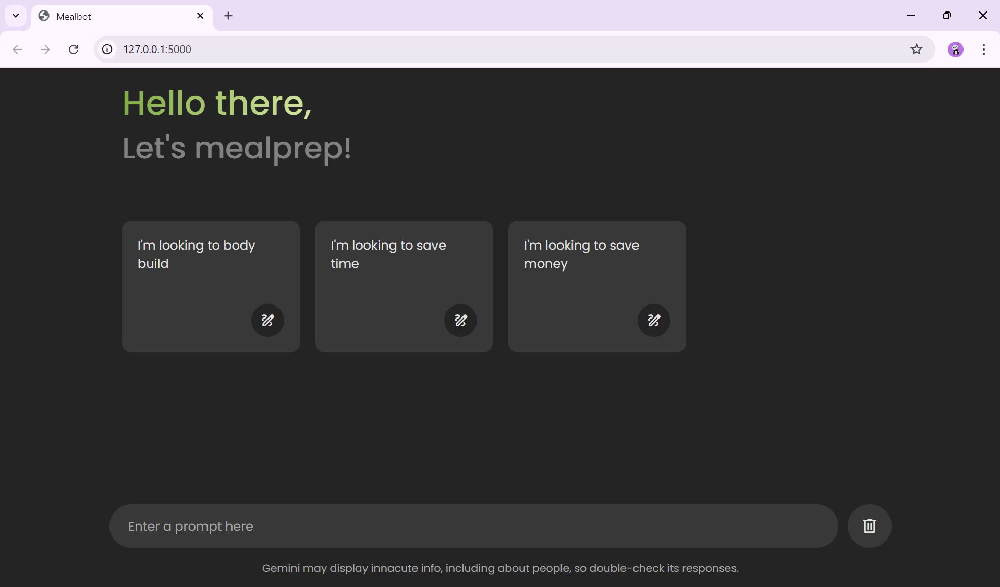

# Bitcamp2025

## Mealbot
Oftentimes college students who live in apartments aren't aware what foods they can make or have access to and as such have poor diets, we sought to help remedy this issue in an easily accessible manner. This is where Mealbot comes in! It is a chatbot that answers all questions about meal prepping. 



## Tech Stack

* Frontend: HTML, CSS, JavaScript
* Backend: Flask (Python)
* AI Model: Gemini API

## Setup Instructions (Local Development)

To run MealPrepBot on your local machine, follow these steps:

**Prerequisites:**

* Python 3.9 or above installed
* A Google Cloud account with access to the Gemini API
* Git (optional, for cloning the repository)

**1.  Clone the Repository (Optional):**

    If you have Git installed, you can clone the project repository:

    ```bash
    git clone <repository_url> 
    cd mealbot_bitcamp2025  # Navigate to the project directory
    ```


**3.  Install Dependencies:**

    Install the required Python packages from the requirements.txt
